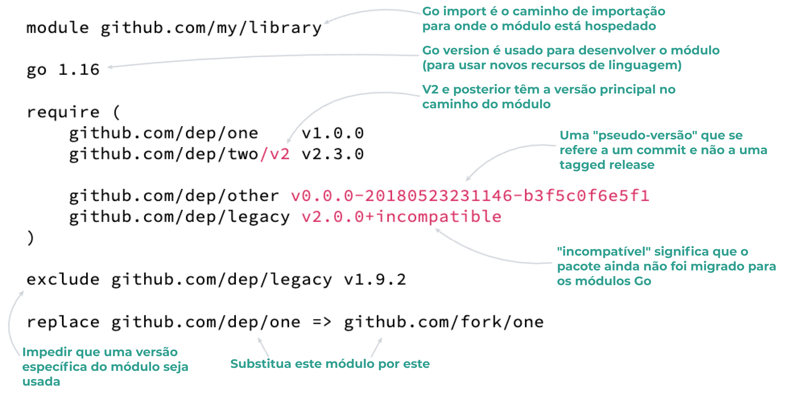
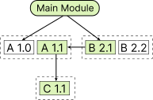

# Quick start

## Gerenciamento de Dependências

```zsh
go get -d github.com/path/to/module       # adiciona ou atualiza uma dependência
go get -d github.com/dep/two/v2@v2.1.0    # usa uma versão específica
go get -d github.com/dep/commit@branch    # usa um branch específica
go get -d -u ./...                        # atualize todos os módulos usados ​​em subdiretórios

go get -d github.com/dep/legacy@none      # remove dependência
```

## Comandos úteis

```bash
go mod tidy                               # organize e limpe go.mod e go.sum
go mod download                           # baixa as dependências para o cache do módulo
go mod init github.com/path/to/module     # inicializa um novo módulo
go mod why -m github.com/path/to/module   # por que o módulo é uma dependência?
go install github.com/path/to/bin@latest  # faz o build e instala um binário
```

## Anatomia de go.mod

<div align="center">
    
</div>

## Seleção de versão mínima (MVS)

Para construir um programaGo, precisamos saber exatamente quais dependências precisa e qual versão usar.

Go usa MVS como uma maneira previsível e simples de decidir qual versão usar.

Funciona assim:

1. O módulo a partir do qual você está executando é o "módulo principal".

2. Encontre todas as dependências de que o módulo principal precisa (recursivamente, usando os go.mod arquivos das dependências ).

3. Para cada dependência, use a maior versão que qualquer go.mod especificado explicitamente.

### Exemplo

<div align="center">
  
</div>

Neste exemplo, o módulo principal depende de A 1.0 e B 2.1.

Como B 2.1 depende de A 1.1, esta é a versão A que será usada.

Uma vez que A 1.1 é usado, ele também puxa C 1.1.

A lista de dependências final é:

- A 1.1
- B 2.1
- C 1.1

## Referência

[Encode](https://encore.dev/guide/go.mod)
